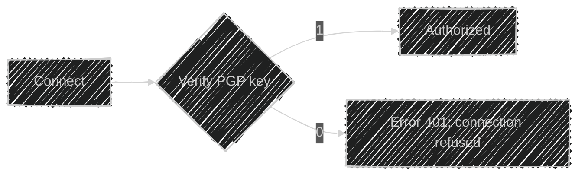

## 0x00 > whoami  
|||  
   
  

> Everything is open source if you can read assembly

```bash
┌──(visitor㉿github)-[~]  
└─$ telnet 42berlin.de 23
Trying 213.136.8.188...
telnet: connect to address 213.136.8.188: Operation timed out
Trying 2a:00:42::1...
telnet: connect to address 2a:00:42::1: Connection established
Authorization required
  Login: mcutura
  Password: ********
Access granted. Welcome aboard.
```



[PGP key](assets/public_key.asc)  

---

## 0x01 > cat /proc/skills

```asm
section .data
    skills db "C/C++", "Rust", "x86_64 asm", "Python", "Typescript", 0
    tools  db "Docker", "Kubernetes" "OpenShift", "gdb", "hexdump", 0

section .text
    global _start
    extern set_x_params

_start:
    ; Hacking through time since 0x7E7
    call set_x_params
    mov rax, 0x2a
    syscall
    ; ⚠ Warning: Clock skew detected
```

---

## 0x02 > ls -la ~/projects/

```bash
drwxr-xr-x  2 mc-putchar wheel       4096 Jul 31 21:42 ./
drwxr-xr-x 42 mc-putchar wheel       4096 Jul 31 21:42 ../
-rw-------  1 nouser     nogroup        0 May 02 21:42 .classified
-rwxr-xr-x  1 mc-putchar agents       512 Feb 24 21:42 convinceme_stark*
-r-s--x--x  1 mc-putchar hackers      256 Jan 08 21:42 cybersecurity-piscine
-rwxr-xr-x  1 mc-putchar hackers     1337 Jan 15 21:42 dr_quine*
-rwxr-xr-x  1 mc-putchar developers  2048 Dec 04 21:42 ft_transcendence*
-rwxr-xr-x  1 mc-putchar developers  4096 Dec 03 21:42 ddd-opti*
```

- **[`dr_quine`](https://github.com/mc-putchar/dr_quine):** *Self-replicating programs*  
  `# Because sometimes code needs to reproduce itself.`  
- **[`cybersecurity-piscine`](https://github.com/mc-putchar/cybersecurity-piscine):** *Offensive security toolkit.*  
  `# First dive into the dark arts of exploits.`  
- **[`ddd-opti`](https://github.com/mc-putchar/ddd-opti):** *Dancing drones dialogue*  
  `# Making drones dance to the music.`  

---

## 0x04 > cat /var/log/berlin.log

```log
[2023-05-03 03:37:42] INFO: Another sleepless night in the Neukoelln underground
[2025-01-03 13:37:43] DEBUG: NRG levels critically low, switching to Club Mate mode
[2025-01-03 13:37:44] WARN: Social life process killed by signal SIGTERM
[2025-01-03 13:37:45] INFO: New vulnerability discovered in [REDACTED]
[2142-02-31 13:37:46] ERROR: exit vim requested - permission denied :q!
```


---

## 0x08 > cat /proc/meminfo | grep "Motivation"

[](https://buymeacoffee.com/mcputchar) [](https://ko-fi.com/mcputchar) 

---

## 0x10 > tail -f /dev/urandom

```
01001000 01100001 01100011 01101011 00100000 01110100 01101000 01100101 
00100000 01110000 01101100 01100001 01101110 01100101 01110100 00100001
```

But responsibly, and with proper authorization

```bash
┌──(visitor㉿github)-[~/mc-putchar]  
└─$ shred /var/log/auth.log; dd if=/dev/null of=~/.bash_history && history -c && exit
Connection to mcp://github.com closed.
```
